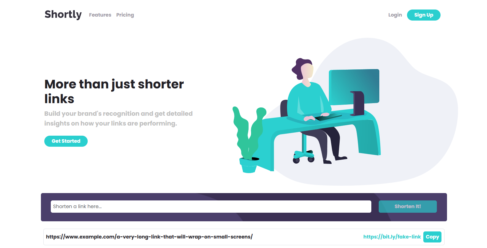

# Project 2: React Development

[Karl Johnson](https://github.com/hirekarl)  
2025-RTT-30  
<time datetime="2025-08-11">2025-08-11</time>  

## Overview
### Viewer Instructions
Navigate to https://wondrous-begonia-039680.netlify.app/ in the browser.

### Submission Source
Top-level application behavior can be found in [`./src/App.tsx`](./src/App.tsx).

### Reflection
Write a 200-300 word reflection discussing your development process, challenges faced, solutions implemented, and potential improvements.

> Have mercy! A few design elements are missing, especially in the "Info" section, where the spec calls for special positioning and a decorative line connecting the cards. I got too far working in the React Bootstrap ecosystem before I realized some of this custom CSS was going to be difficult to wrangle with the built-in components I chose, so I opted for nailing the functionality and approximating design implementation details in a few spots.
>
> Note that the Bitly API only allows for five shortlinks per month, and I've already used two. I tested the fetch functionality, and it works; I put in the details of the two URLs I was able to create with the API to demonstrate where subsequent real URLs will end up when the app is run for real. I'm fairly certain the `useLocalStorage` hook works (and sets the given URLs as a default value on first load), but I wasn't able to test with new shortlinks, given the API constraints.
> 
> The main "reusable" component I implemented for this was a `ThemedButton`, which changes rounding, padding, and functionality based on given props. I managed to implement a change of background color when a shortlink is copied. I'm certain I could clean up the implementation of `ThemedButton` and make it even more reusable with more time.
>
> Working around the API constraints for this was the most difficult part (I tried a few other APIs but ran into the same issue); the other was working with Bootstrap to implement the design elements that change by breakpoint. (I'm looking forward to our shift to the back end!) I particularly like that when you hover over the "Shortly" logo, it compresses. I didn't see any reason to implement contexts for this, or any hooks beyond the `useLocalStorage` hook.

## Assignment
For this cumulative assessment on React, you will select and complete one of the following Frontend Mentor  challenges:

2. [**URL Shortening API Landing Page**](https://www.frontendmentor.io/challenges/url-shortening-api-landing-page-2ce3ob-G): Create a landing page that integrates with the [bitly API](https://dev.bitly.com/)  to shorten URLs, featuring a list of shortened links and the ability to copy them to the clipboard.
- [Click here to download the starter files.](https://ps-lms.vercel.app/curriculum-assets/414/url-shortening-api-master.zip)
- **Important Note**: Due to Cross-Origin Resource Sharing (CORS) policies causing errors with the originally suggested [CleanURI](https://cleanuri.com/)  API, we have modified this project to use the [bitly ](https://bitly.com/) API.

The code, briefs, and images for each challenge are included within this module as well, for reference. You should use the material included with this module, just in case the challenges changes in scope or [*sic*]

This project aims to assess your ability to apply the skills and knowledge acquired throughout the course in a practical, real-world scenario. Choose the challenge that best aligns with your interests and strengths, and demonstrate your proficiency in front-end development.

### Look Famililar?
If you have completed the HTML, CSS, and JavaScript modules with Per Scholas, you may be familiar with these project starters. As part of this project, you will be required to use React, but the project will be very similar to the projects you completed in the HTML, CSS, and JavaScript modules.

To challenge yourself, try to complete the project without using too much of the code from your previous projects. Or, if you are feeling ambitious, complete one (or both!) of the options you have not yet worked on.
